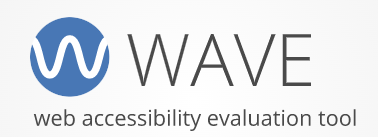
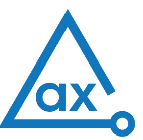

# AXE-Cypress
AXE + Cypress: A dupla dinâmica da acessibilidade digital - Muitos dos bugs de acessibilidade digital podem ser encontrados na fase de desenvolvimento e teste de um novo produto. Para essas tarefas, o uso de ferramentas e testes automatizados podem facilitar muito o trabalho da equipe antes do produto chegar para o teste com usuários reais. Nessa palestra, iremos demonstrar como inserir e rodar testes de acessibilidade digital usando o queridinho Cypress juntamente com a biblioteca do Axe-core. Fonte https://thedevconf.com/tdc/2022/innovation/trilha-stadium-sexta

# Ferramentas para análise web de acessibilidade 

**WAVE**
 

 

**AXE**
 

 

