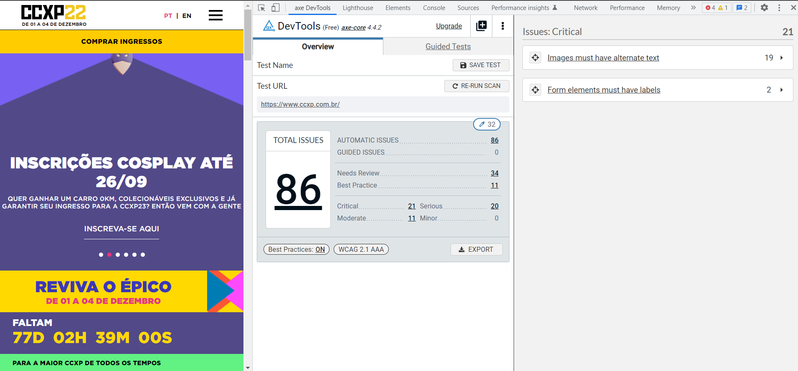

# Ferramentas para análise web de acessibilidade 

## Testes Semi-automatizados

**WAVE**
 

https://wave.webaim.org/
 

**AXE**
 

https://www.deque.com/axe/devtools/

 

## Testes automatizados - Axe-CLI

# AXE-Cypress
AXE + Cypress: A dupla dinâmica da acessibilidade digital - Muitos dos bugs de acessibilidade digital podem ser encontrados na fase de desenvolvimento e teste de um novo produto. Para essas tarefas, o uso de ferramentas e testes automatizados podem facilitar muito o trabalho da equipe antes do produto chegar para o teste com usuários reais. Nessa palestra, iremos demonstrar como inserir e rodar testes de acessibilidade digital usando o queridinho Cypress juntamente com a biblioteca do Axe-core. Fonte https://thedevconf.com/tdc/2022/innovation/trilha-stadium-sexta

# Instalando node

npm init
Este comando vai criar o arquivo package.json, que é onde está toda a configuração do seu projeto, includindo, nome, versão, descrição, scripts a serem executados, licença, etc.

Após executar o npm init, o npm vai perguntar algumas informações básicas para montar o package.json. São elas:

package name: Nome do projeto. (Padrão: nome da pasta onde o comando foi executado)
version: Versão do projeto. (Padrão: 1.0.0)
description: Uma descrição para o projeto.
entry point: Arquivo padrão que será utilizado para executar a aplicação. (Padrão: index.js)
test command: Comando para executar os testes da aplicação.
git repository: URL do repositório git onde o código-fonte da aplicação será armazenado.
keyword: Palavras-chave relevantes para ajudar as pessoas a encontrarem o seu projeto.
author: Autor do projeto.
license Tipo de licença do projeto. (Padrão: ISC)